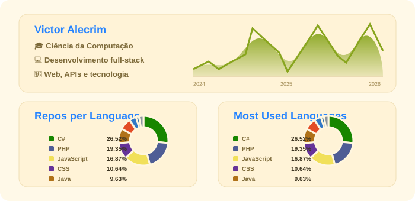

---

## 👨‍💻 Sobre mim

Desenvolvedor em formação e estudante de Ciência da Computação (5º período), com interesse em desenvolvimento web, engenharia de software e arquitetura de sistemas. Busco constantemente aprimorar minhas habilidades técnicas e contribuir com soluções eficientes e de qualidade.

---

## 🛠️ Tecnologias que uso

  
  
  
  
  
  
  
  
  
  
  
  
  

---

## 📊 Estatísticas GitHub

  <table>
    <tr>
      <td valign="top" width="55%">
        
      </td>
      <td valign="top" width="45%">
        
      </td>
    </tr>
  </table>

## 📫 Contato

  
  

---

  
    Stats auto-geradas por
    <a href="https://github.com/victoralecrim11/victoralecrim11/blob/main/.github/workflows/update-lang-stats.yml">GitHub Actions</a>
    · Atualizadas diariamente
  

